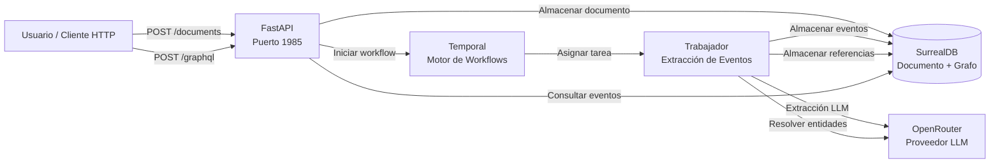

# Espacio Tiempo Humanos

Sistema de ingesta de documentos y extracción de eventos para documentos legales y judiciales en español.

Los documentos se ingieren vía HTTP, un LLM extrae eventos estructurados (espacio, tiempo, participantes, objetos, qué pasó), las referencias textuales se resuelven en entidades canónicas, y todo es consultable vía GraphQL — con trazabilidad de auditoría completa desde el resultado de la consulta hasta el documento fuente.

Este proyecto es un experimento codificado 100% por Deepseek v4 Flash usando opencode + opengsd.

## Tabla de Contenidos

- [Inicio Rápido](#inicio-rápido)
- [Arquitectura](#arquitectura)
- [Documentación de la API](#documentación-de-la-api)
- [Configuración](#configuración)
- [Solución de Problemas](#solución-de-problemas)

## Inicio Rápido

### Prerrequisitos

- [Docker](https://docs.docker.com/get-docker/) y [Docker Compose](https://docs.docker.com/compose/install/)
- [httpie](https://httpie.io/) (para probar la API — opcional, puedes usar cualquier cliente HTTP)
- Una clave API de [OpenRouter](https://openrouter.ai/) (para extracción de eventos vía LLM)

### Instalación

1. **Clonar el repositorio:**

   ```bash
   git clone <repo-url>
   cd eth
   ```

2. **Configurar variables de entorno:**

   ```bash
   cp .env.example .env
   ```

   Edita `.env` y define tu `OPENROUTER_API_KEY`.

3. **Construir e iniciar todos los servicios:**

   ```bash
   docker compose up -d --build
   ```

   Esto inicia:
   - **SurrealDB** — base de datos multi-modelo en el puerto 8000
   - **MinIO** — almacenamiento de blobs compatible con S3 en puertos 9000 (API) y 9001 (consola)
   - **Temporal Server** — motor de workflows en el puerto 7233 (UI en puerto 8080)
   - **Temporal UI** — panel de control de workflows en el puerto 8080
   - **Schema Init** — migración del esquema de base de datos (se ejecuta una vez y termina)
   - **Bucket Init** — creación del bucket de MinIO (se ejecuta una vez y termina)
   - **API** — servidor FastAPI en el puerto anfitrión 1985
   - **Worker** — trabajador de Temporal para procesamiento de documentos

   > `--build` reconstruye las imágenes desde el código fuente. En inicios posteriores puedes omitirlo:
   > ```bash
   > docker compose up -d
   > ```
   > Después de cambios de código, reconstruye solo los servicios afectados:
   > ```bash
   > docker compose up -d --build api worker schema-init
   > ```

4. **Verificar que la API está funcionando:**

   ```bash
   http http://localhost:1985/health
   ```

   Respuesta esperada:

   ```json
   {
       "status": "ok"
   }
   ```

5. **Ejecutar pruebas de integración:**

   ```bash
   docker compose run --rm integration-tests
   ```

   Esto compila y ejecuta el conjunto de pruebas TypeScript contra todos los servicios activos (health de la API, CRUD de documentos, consultas GraphQL, fusión/división de entidades, carga de blobs, transparencia de chunks). Las dependencias (`surrealdb`, `api`, etc.) se inician automáticamente y pasan health checks antes de ejecutar las pruebas.

   Para detener todos los servicios después de las pruebas:
   ```bash
   docker compose down
   ```

## Arquitectura



### Flujo de Datos

1. **Ingesta** — Se envía un documento (texto plano con nombre de archivo/metadatos) vía `POST /documents`. La API lo almacena en SurrealDB con `status: "pending"` e inicia un workflow en Temporal.

2. **Extracción** — El workflow de Temporal ejecuta una actividad de extracción LLM que envía el texto del documento a OpenRouter con un esquema JSON estructurado. El LLM devuelve eventos estructurados con referencias textuales: para cada evento identifica el `espacio` (lugar), `tiempo` (momento), `humanos` (personas), `objetos` (cosas), y `que-paso` (lo ocurrido) — todo anclado al texto fuente exacto.

3. **Resolución** — Una segunda actividad resuelve las referencias textuales en entidades canónicas. Las referencias al mismo lugar, persona u objeto se acumulan bajo una única entidad canónica con trazabilidad de procedencia completa. La resolución se agrupa por tipo (lugar/persona/objeto; las referencias temporales se mantienen tal cual).

4. **Consulta** — Los eventos extraídos, las entidades canónicas y las referencias textuales se pueden consultar vía GraphQL a través del proxy `POST /graphql`. Cada evento es trazable hasta su documento fuente y su texto exacto.

### Patrones Clave

- **Ejecución durable** — Temporal asegura que los workflows sobrevivan reinicios del proceso. Si un worker falla durante la extracción, el workflow reintenta con backoff exponencial (máximo 3 intentos).
- **Anular y recrear** — La resolución de entidades usa un patrón seguro de repetición: las referencias existentes se anulan antes de crear las nuevas, evitando duplicados durante la repetición de Temporal.
- **LLM agnóstico al proveedor** — La capa de extracción usa una abstracción basada en protocolos (`LLMProvider`). OpenRouter es la primera implementación; se pueden añadir otros proveedores sin cambiar la lógica de extracción.
- **Trazabilidad completa** — Blob original → texto extraído → extracción LLM → entidades resueltas — cada paso tiene su marca de tiempo y se almacena, para que cualquier salida del LLM pueda rastrearse hasta su texto fuente.

## Documentación de la API

Todas las peticiones usan `httpie`. Reemplaza `localhost:1985` con la dirección de tu servidor según sea necesario.

### GET / — Información de la API

Devuelve metadatos sobre la API y una lista de endpoints disponibles.

```bash
http http://localhost:1985/
```

```json
{
    "name": "eth-pipeline",
    "version": "0.1.0",
    "endpoints": {
        "/": "Esta información",
        "/health": "Verificación de estado",
        "/documents": "Enviar un documento para procesamiento (POST)",
        "/documents/{document_id}": "Obtener estado del documento (GET)",
        "/entities/merge": "Fusionar dos entidades canónicas del mismo tipo (POST)",
        "/entities/{entity_type}/{entity_id}/split": "Dividir referencias en nuevas entidades canónicas (POST)",
        "/graphql": "Proxy a SurrealDB auto-GraphQL (POST)"
    }
}
```

### GET /health — Verificación de Estado

Devuelve `{"status": "ok"}` cuando el proceso de la API está funcionando.

```bash
http http://localhost:1985/health
```

```json
{
    "status": "ok"
}
```

### POST /documents — Ingresar un Documento

Envía un documento para procesamiento. El documento se almacena en SurrealDB y se inicia un workflow de Temporal para extraer eventos.

```bash
http POST http://localhost:1985/documents \
    text="El día 15 de marzo de 2023, Juan Pérez compareció ante el tribunal en Madrid. El acusado presentó su declaración ante la juez María García." \
    filename="declaracion.txt"
```

```json
{
    "document_id": "a1b2c3d4e5f6...",
    "status": "pending"
}
```

**Cuerpo de la petición:**

| Campo | Tipo | Descripción |
|-------|------|-------------|
| `text` | string | El contenido del texto del documento |
| `filename` | string | Nombre del archivo fuente (como referencia) |
| `mime_type` | string o null | Tipo MIME (por defecto `text/plain`) |

**Respuestas:**

| Estado | Descripción |
|--------|-------------|
| 201 | Documento creado y encolado para procesamiento |
| 503 | SurrealDB no está disponible |
| 502 | Error al almacenar el documento en la base de datos |

### GET /documents/{document_id} — Obtener Estado del Documento

Recupera el estado actual y metadatos de un documento previamente enviado.

```bash
http http://localhost:1985/documents/a1b2c3d4e5f6...
```

```json
{
    "document_id": "a1b2c3d4e5f6...",
    "status": "completed",
    "filename": "declaracion.txt",
    "error_message": null,
    "created_at": "2026-05-31T12:00:00Z"
}
```

**Valores de estado:** `pending` → `processing` → `completed` | `failed`

**Respuestas:**

| Estado | Descripción |
|--------|-------------|
| 200 | Documento encontrado con su estado actual |
| 404 | Documento no encontrado |
| 503 | SurrealDB no está disponible |

### POST /graphql — Proxy de Consultas GraphQL

Consulta eventos, entidades y referencias a través de la interfaz auto-GraphQL de SurrealDB.

```bash
http POST http://localhost:1985/graphql query="
{
    event {
        id
        que_paso
        espacio
        humanos
        document_id
        references {
            id
            verbatim_text
            reference_type
        }
    }
}"
```

```json
{
    "data": {
        "event": [
            {
                "id": "event:abc123",
                "que_paso": "compareció ante el tribunal",
                "espacio": "Madrid",
                "humanos": "Juan Pérez",
                "document_id": "document:def456",
                "references": [
                    {
                        "id": "ref:789",
                        "verbatim_text": "Juan Pérez",
                        "reference_type": "person"
                    }
                ]
            }
        ]
    }
}
```

**Nota:** Este endpoint hace proxy directamente al endpoint auto-GraphQL de SurrealDB. Las consultas disponibles dependen de las definiciones del esquema SurrealDB.

### POST /entities/merge — Fusionar Entidades Canónicas

Fusiona dos entidades canónicas del mismo tipo. Todas las referencias de la entidad origen se reconectan a la entidad destino, y la origen se marca como eliminada (soft-delete).

```bash
http POST http://localhost:1985/entities/merge \
    target_id="person:uuid1" \
    source_id="person:uuid2"
```

```json
{
    "status": "merged",
    "target_id": "person:uuid1",
    "source_id": "person:uuid2",
    "rewired_references": 3
}
```

**Condiciones de validación (todas deben cumplirse):**
- Ambas entidades existen y no están ya fusionadas
- Ambas entidades tienen el mismo `entity_type`
- Origen y destino son entidades diferentes
- El destino no está a su vez fusionado dentro del origen

### POST /entities/{entity_type}/{entity_id}/split — Dividir Entidad Canónica

Redistribuye las referencias de una entidad entre múltiples entidades canónicas nuevas. La entidad original se marca como reemplazada y sus referencias se redistribuyen.

```bash
http POST http://localhost:1985/entities/person/uuid-a-dividir \
    entities:='[
        {"name": "Juan Pérez García"},
        {"name": "Juan Pérez López"}
    ]'
```

```json
{
    "status": "split",
    "source_id": "person:uuid-a-dividir",
    "created_ids": ["person:new-uuid-1", "person:new-uuid-2"],
    "redistributed_references": 5
}
```

**Condiciones de validación (todas deben cumplirse):**
- La entidad origen existe y no está reemplazada
- Se proporcionan al menos 2 nombres de entidad nuevos
- Cada nombre de entidad nuevo es único
- Cada nombre de entidad nuevo es diferente del origen

## Configuración

Copia `.env.example` a `.env` y configura las siguientes variables:

| Variable | Descripción | Valor por Defecto / Ejemplo |
|----------|-------------|-----------------------------|
| `OPENROUTER_API_KEY` | Clave API para acceso a OpenRouter LLM | `sk-or-v1-...` |
| `OPENROUTER_MODEL` | Identificador del modelo LLM para extracción de eventos | `openai/gpt-4o-mini` |
| `SURREAL_URL` | URL de conexión WebSocket a SurrealDB | `ws://localhost:8000/rpc` |
| `SURREAL_USER` | Usuario de autenticación de SurrealDB | `root` |
| `SURREAL_PASS` | Contraseña de autenticación de SurrealDB | `root` |
| `SURREAL_NS` | Namespace de SurrealDB | `eth` |
| `SURREAL_DB` | Nombre de la base de datos SurrealDB | `pipeline` |

## Solución de Problemas

### Docker Compose no arranca

**Síntoma:** `docker compose up` termina con errores.

**Verificar:** Asegúrate de que Docker esté funcionando y que los puertos 1985, 8000, 7233 y 8080 no estén en uso:

```bash
lsof -i :1985 -i :8000 -i :7233 -i :8080
```

### La API devuelve 503 Service Unavailable

**Síntoma:** `POST /documents` o `GET /documents/{id}` devuelve 503.

**Causa:** SurrealDB aún no está saludable. La API depende de `schema-init`, que a su vez depende del healthcheck de SurrealDB. Espera unos segundos y reintenta.

### El documento se queda en estado "pending"

**Síntoma:** Un documento enviado nunca pasa a `processing` o `completed`.

**Verificaciones:**

1. Comprueba que el worker esté funcionando:
   ```bash
   docker compose ps worker
   ```

2. Verifica que Temporal Server sea accesible:
   ```bash
   http http://localhost:7233/
   ```

3. Revisa los logs del worker para errores de actividad:
   ```bash
   docker compose logs worker --tail 50
   ```

Si el worker no está funcionando, inícialo:
```bash
docker compose up -d worker
```

### La extracción de entidades no produce eventos

**Síntoma:** Los documentos completan el procesamiento pero no aparecen eventos en las consultas GraphQL.

**Causa:** El LLM puede haber devuelto un formato de respuesta inesperado. Revisa los logs de la actividad de extracción en el worker:

```bash
docker compose logs worker | grep extract
```

Si el problema persiste, verifica que tu `OPENROUTER_API_KEY` sea válida y que el modelo esté disponible. Después de cambiar `.env`, reconstruye y reinicia:

```bash
docker compose up -d --build worker
```

### "Cannot perform subtraction with 'record' and 'table'"

**Síntoma:** Error de consulta SurrealDB al obtener un documento inexistente.

**Causa:** Una limitación conocida de las tablas SCHEMAFULL de SurrealDB v3 al usar referencias a registros en línea. La API maneja esto internamente, pero si ves este error en consultas personalizadas, usa la sintaxis parametrizada `WHERE id = $doc_id` en lugar de referencias a registros en línea.
