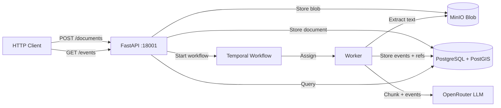

# Espacio Tiempo Humanos

A document ingestion and event extraction pipeline for Spanish-language legal/court documents. You submit text or PDFs, an LLM extracts structured events (where, when, who, what), and the result is fully traceable back to the original source.

Built 100% by Deepseek v4 Flash via opencode + opengsd.

## Quickstart

```bash
cp .env.example .env        # set OPENROUTER_API_KEY (TUNNEL_TOKEN optional, see below)
./run.sh                    # starts the full dev stack via docker compose
http :18001/health          # {"status": "ok"}
```

That's it. Submit a document, and the pipeline runs automatically. Stop everything with `./stop.sh`.

> **Docker only (one exception):** all tooling (pytest, alembic, uv, npm) runs via the scripts
> below or `docker compose run` — never ad-hoc on the host. The single exception is dependency-free
> unit tests: `./test.sh --unit` runs them on the host without containers (see [Tests](#tests)).

### Dev scripts

| Script | What it does |
|--------|--------------|
| `./run.sh` | `docker compose up -d` of the full stack. Starts `cloudflared` **only** when `TUNNEL_TOKEN` is set in `.env` (it lives in the `tunnel` compose profile). Pass-through args, e.g. `./run.sh --build`. |
| `./stop.sh` | `docker compose down` — data volumes are **preserved**. `./stop.sh -v` wipes them. |
| `./test.sh` | Python test suite in an **isolated, disposable** stack: separate compose project (`eth-test`), separate volumes, no host ports, `down -v` before *and* after every run → always a **fresh clean database**, never touches the dev stack. |
| `./test.sh tests/test_schema.py -q` | Same, for selected files / pytest args. |
| `./test.sh --unit` | Only tests with **no dependencies and no state** (auto-marked `integration` if they use a DB fixture) — runs on the host with `uv`, no containers, sub-second feedback. |
| `RUN_SLOW_TESTS=1 ./test.sh` | Also run slow spike/migration tests (skipped by default). |
| `KEEP_TEST_ENV=1 ./test.sh` | Leave the test stack up afterwards for debugging (`docker compose -p eth-test ... ` to inspect). |

### Services (all in one `./run.sh`)

| Service | Purpose | Port |
|---------|---------|------|
| **PostgreSQL** (+PostGIS) | Event storage, geospatial queries | 15432 |
| **MinIO** | PDF blob storage | 19000 |
| **Temporal** | Durable workflow engine | 17233 |
| **Temporal UI** | Workflow dashboard | 18080 |
| **API** | FastAPI — document ingestion + queries | 18001 |
| **Worker** | Temporal worker — runs extraction activities | — |
| **Cloudflared** | Public tunnel (`tunnel` profile, needs `TUNNEL_TOKEN`) | — |

## How It Works

The pipeline is a single Temporal workflow (`DocumentProcessingV7Workflow`) that runs per document:

```
Submit → status=pending
  ↓
Extract text (PDF → pypdfium2, or use submitted text)
  ↓
Chunk (sentence-aware, ~512KB targets, part-provenance tracking)
  ↓ [for each chunk]
LLM extracts structured events (OpenRouter, JSON Schema output)
  ↓
Store events in PostgreSQL (event_v2, event_location, event_participant_v2, event_ref)
  ↓
Resolve references (compute character + page offsets for provenance)
  ↓
status=processed → ready to query
```

Each activity is retried (max 3 attempts, exponential backoff). If the worker crashes, Temporal resumes from the last completed step — no data loss, no duplicates.

### What Gets Extracted

For each document chunk, the LLM returns structured events with verbatim references:

```
Event: "Juan Pérez compareció ante el tribunal en Madrid"
  ├─ Location: Madrid
  ├─ Time: 15 de marzo de 2023
  ├─ Participants: Juan Pérez, María García
  └─ What happened: compareció ante el tribunal
```

Every verbatim mention (person name, place, date) is stored as a reference with exact character offsets — you can click a person in the UI and see the exact sentence they appear in.

### Querying Results

```bash
# List events (paginated, filterable by document)
http GET :18001/events

# Event detail with locations, participants, and references
http GET :18001/events/{id}

# Get processing logs for a document
http GET :18001/documents/{id}/logs

# Submit a plain-text document
http POST :18001/documents text="El día 15 de marzo..." filename="decl.txt"

# Upload a PDF
http POST :18001/documents/upload @file.pdf
```

There's also a web UI at `/ui` — no build step, vanilla HTML/CSS/JS served by FastAPI.

## Architecture



### Key Patterns

- **Durable execution** — Temporal survives crashes. Replay is safe (nullify-then-recreate pattern prevents duplicates).
- **Search-first resolution** — Entity resolution checks existing canonical entities before calling the LLM. Exact matches skip the LLM entirely (20-50% savings).
- **Deterministic offsets** — Page numbers and character offsets are computed from chunk metadata, never hallucinated by the LLM.
- **Provider-agnostic LLM** — Protocol-based abstraction (`LLMProvider`). OpenRouter is first; swap without changing extraction logic.
- **Full audit trail** — blob → text → chunks → events → references → canonical entities. Every step timestamped, every value traceable.

## Status

Active milestone: **v7.0 Event-Centric Rewrite** — new PostgreSQL schema with unified event model, smart chunking (512KB sentence-aware), part-by-part LLM extraction, event list/detail UI with clickable references.

Prior milestones shipped:
- v6.1 — LLM call logging & viewer
- v6.0 — Event-centric data quality & UI
- v5.x — Entity resolution, cost tracking, prompt fixes
- v4.0 — Pipeline quality, reference offsets, search-first resolution
- v3.0 — Web UI
- v2.0 — Blob & chunk pipeline
- M001/M002 — Core pipeline + entity resolution

## Configuration

Copy `.env.example` → `.env`. Key variables:

| Variable | Default | Description |
|----------|---------|-------------|
| `OPENROUTER_API_KEY` | — | API key for LLM access |
| `OPENROUTER_MODEL` | `openai/gpt-4o-mini` | LLM model for extraction |
| `CHUNK_SIZE_TARGET` | `524288` | Target chunk size in chars (512KB) |

## Tests

Use `./test.sh` — it runs the suite in an isolated compose project (`eth-test`) with its own
volumes and no host ports, torn down (`down -v`) before and after every run. Tests therefore
**always run against a fresh database** and never collide with (or pollute) the dev stack.

```bash
./test.sh                          # full Python suite, fresh env, ~10s after first build
./test.sh tests/test_schema.py -q  # selected files / any pytest args
./test.sh --unit                   # ONLY dependency-free unit tests, on the host, no containers
RUN_SLOW_TESTS=1 ./test.sh         # include slow tests (LLM corpus spike, migration round-trips)
KEEP_TEST_ENV=1 ./test.sh          # keep the eth-test stack up afterwards for debugging
```

**The unit-test rule:** tests that need PostgreSQL or any external state are auto-marked
`integration` (by fixture usage, in `tests/conftest.py`) and are excluded from `--unit`. Only
unit tests that mock all I/O run on the host — they touch no containers and leave no state,
so they are the fast inner loop for development. Anything else must run through `./test.sh`.

Do **not** run `pytest`, `alembic`, `uv`, or `npm` ad-hoc on the host outside these scripts —
it risks mutating your local environment or writing to the wrong database.

TypeScript integration tests hit the **running dev stack** (start it first with `./run.sh`):

```bash
docker compose run --rm integration-tests
```

`python-tests` bind-mounts `./src`, `./tests`, `./test_data`, and `alembic.ini` into the image, so
it always tests your working tree — no rebuild needed (`test.sh` passes `--build` so image changes
to `scripts/` or dependencies are picked up). It waits for a healthy Postgres and a completed
`schema-init`, and caches Python dependencies in a `uv-cache` volume.

## Database & Migrations

The database is Postgres + PostGIS, only ever reached through the compose network (or `localhost:15432`
for inspection). Schema management has two parts:

1. **Fresh databases** — the one-shot `schema-init` service (runs on every `docker compose up`)
   detects an unversioned database, applies `src/eth_pipeline/schema.sql` as the **v6 baseline**,
   then runs `alembic upgrade head` (0001 v7 tables → 0002 drop v6 tables → 0003 llm_provider).
   On a database already under Alembic control it is a **no-op** (it never re-applies the baseline).
2. **Schema changes after that** — regular Alembic migrations in `src/eth_pipeline/alembic/versions/`
   (`0001` → `0003` and onward). All Alembic commands run inside the container:

```bash
docker compose run --rm api uv run alembic current              # where is the DB?
docker compose run --rm api uv run alembic upgrade head         # apply pending migrations
docker compose run --rm api uv run alembic downgrade -1         # roll back one

# Autogenerate a new revision against the current DB (source mounted so the
# new file lands in ./src/eth_pipeline/alembic/versions/ on the host)
docker compose run --rm -v "$PWD/src:/app/src" api \
  uv run alembic revision --autogenerate -m "describe change"
docker compose run --rm -v "$PWD/src:/app/src" api uv run alembic upgrade head
```

Connection settings come from `PGUSER/PGPASSWORD/PGHOST/PGPORT/PGDATABASE` env vars (set to the
compose service names inside containers by `docker-compose.yml`), consumed by `alembic.ini`.

To start over from a clean database:

```bash
docker compose down -v    # DELETES the postgres + minio volumes
docker compose up -d      # schema-init recreates the baseline schema
```

Note: `schema.sql` is the **baseline only** — anything created by a migration (e.g. `llm_provider`,
`document.provider_id/model`) must NOT appear in it. If you change the schema, add an Alembic
revision; touch `schema.sql` only for baseline objects. For a clean slate use `./test.sh`
(already fresh) or `./stop.sh -v && ./run.sh` for the dev stack.
