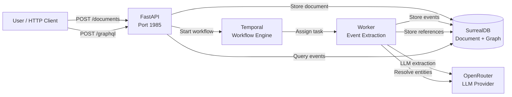

# Espacio Tiempo Humanos

A document ingestion and event extraction system for Spanish-language legal and court documents.

Documents are ingested via HTTP, an LLM extracts structured events (space, time, participants, objects, what-happened), verbatim references are resolved into canonical entities, and everything is queryable via GraphQL — with full audit traceability from query result back to source document.

## Table of Contents

- [Quickstart](#quickstart)
- [Architecture](#architecture)
- [API Documentation](#api-documentation)
- [Configuration](#configuration)
- [Troubleshooting](#troubleshooting)

## Quickstart

### Prerequisites

- [Docker](https://docs.docker.com/get-docker/) and [Docker Compose](https://docs.docker.com/compose/install/)
- [httpie](https://httpie.io/) (for API testing — optional, you can use any HTTP client)
- An [OpenRouter](https://openrouter.ai/) API key (for LLM-based event extraction)

### Setup

1. **Clone the repository:**

   ```bash
   git clone <repo-url>
   cd eth
   ```

2. **Configure environment variables:**

   ```bash
   cp .env.example .env
   ```

   Edit `.env` and set your `OPENROUTER_API_KEY`.

3. **Build and start all services:**

   ```bash
   docker-compose up --build
   ```

   This launches:
   - **SurrealDB** — multi-model database on port 8000
   - **Temporal Server** — workflow engine on port 7233 (UI on port 8080)
   - **Schema Init** — database schema migration (runs once, then exits)
   - **API** — FastAPI server on host port 1985
   - **Worker** — Temporal worker for document processing

4. **Verify the API is running:**

   ```bash
   http http://localhost:1985/health
   ```

   Expected response:

   ```json
   {
       "status": "ok"
   }
   ```

## Architecture



### Data Flow

1. **Ingest** — A document (plain text with filename/metadata) is submitted via `POST /documents`. The API stores it in SurrealDB with `status: "pending"` and starts a Temporal workflow.

2. **Extract** — The Temporal workflow runs an LLM extraction activity that sends the document text to OpenRouter with a structured JSON schema. The LLM returns structured events with verbatim references: for each event it identifies the `espacio` (place), `tiempo` (time), `humanos` (people), `objetos` (objects), and `que-paso` (what happened) — all anchored to exact source text.

3. **Resolve** — A second activity resolves verbatim references into canonical entities. References to the same place, person, or object are accumulated under a single canonical entity with full provenance tracking. Resolution is batched by type (place/person/object; time references are kept as-is).

4. **Query** — Extracted events, canonical entities, and verbatim references are queryable via GraphQL through the `POST /graphql` proxy endpoint. Every event is traceable back to its source document and exact text.

### Key Patterns

- **Durable execution** — Temporal ensures workflows survive process restarts. If a worker crashes during extraction, the workflow retries with exponential backoff (max 3 attempts).
- **Nullify-then-recreate** — Entity resolution uses a safe replay pattern: existing references are nullified before new ones are created, ensuring Temporal replay never produces duplicates.
- **Provider-agnostic LLM** — The extraction layer uses a protocol-based abstraction (`LLMProvider`). OpenRouter is the first implementation; other providers can be added without changing extraction logic.
- **Full audit trail** — Original blob → extracted text → LLM extraction → resolved entities — every step is timestamped and stored, so any LLM output can be traced back to its source text.

## API Documentation

All API requests use `httpie`. Replace `localhost:1985` with your server address as needed.

### GET / — API Information

Returns metadata about the API and a list of available endpoints.

```bash
http http://localhost:1985/
```

```json
{
    "name": "eth-pipeline",
    "version": "0.1.0",
    "endpoints": {
        "/": "This information",
        "/health": "Liveness check",
        "/documents": "Submit a document for processing (POST)",
        "/documents/{document_id}": "Get document status (GET)",
        "/entities/merge": "Merge two canonical entities of the same type (POST)",
        "/entities/{entity_type}/{entity_id}/split": "Partition references across new canonical entities (POST)",
        "/graphql": "Proxy to SurrealDB auto-GraphQL (POST)"
    }
}
```

### GET /health — Liveness Check

Returns `{"status": "ok"}` when the API process is running.

```bash
http http://localhost:1985/health
```

```json
{
    "status": "ok"
}
```

### POST /documents — Ingest a Document

Submits a document for processing. The document is stored in SurrealDB and a Temporal workflow is started to extract events.

```bash
http POST http://localhost:1985/documents \
    text="El día 15 de marzo de 2023, Juan Pérez compareció ante el tribunal en Madrid. El acusado presentó su declaración ante la juez María García." \
    filename="declaracion.txt"
```

```json
{
    "document_id": "a1b2c3d4e5f6...",
    "status": "pending"
}
```

**Request body:**

| Field | Type | Description |
|-------|------|-------------|
| `text` | string | The document text content |
| `filename` | string | Source filename (for reference) |
| `mime_type` | string or null | MIME type (defaults to `text/plain`) |

**Responses:**

| Status | Description |
|--------|-------------|
| 201 | Document created and queued for processing |
| 503 | SurrealDB is unavailable |
| 502 | Failed to store document in database |

### GET /documents/{document_id} — Get Document Status

Retrieves the current status and metadata of a previously submitted document.

```bash
http http://localhost:1985/documents/a1b2c3d4e5f6...
```

```json
{
    "document_id": "a1b2c3d4e5f6...",
    "status": "completed",
    "filename": "declaracion.txt",
    "error_message": null,
    "created_at": "2026-05-31T12:00:00Z"
}
```

**Status values:** `pending` → `processing` → `completed` | `failed`

**Responses:**

| Status | Description |
|--------|-------------|
| 200 | Document found with current status |
| 404 | Document not found |
| 503 | SurrealDB is unavailable |

### POST /graphql — GraphQL Query Proxy

Queries events, entities, and references via SurrealDB's auto-GraphQL interface.

```bash
http POST http://localhost:1985/graphql query="
{
    event {
        id
        que_paso
        espacio
        humanos
        document_id
        references {
            id
            verbatim_text
            reference_type
        }
    }
}"
```

```json
{
    "data": {
        "event": [
            {
                "id": "event:abc123",
                "que_paso": "compareció ante el tribunal",
                "espacio": "Madrid",
                "humanos": "Juan Pérez",
                "document_id": "document:def456",
                "references": [
                    {
                        "id": "ref:789",
                        "verbatim_text": "Juan Pérez",
                        "reference_type": "person"
                    }
                ]
            }
        ]
    }
}
```

**Note:** This endpoint proxies directly to SurrealDB's auto-GraphQL endpoint. The available queries depend on your SurrealDB schema definitions.

### POST /entities/merge — Merge Canonical Entities

Merges two canonical entities of the same type. All references from the source entity are rewired to the target entity, and the source is soft-deleted.

```bash
http POST http://localhost:1985/entities/merge \
    target_id="person:uuid1" \
    source_id="person:uuid2"
```

```json
{
    "status": "merged",
    "target_id": "person:uuid1",
    "source_id": "person:uuid2",
    "rewired_references": 3
}
```

**Validation conditions (all must pass):**
- Both entities exist and are not superseded
- Both entities have the same `entity_type`
- Source and target are different entities
- Target is not itself superseded by the source

### POST /entities/{entity_type}/{entity_id}/split — Split Canonical Entity

Partitions an entity's references across multiple new canonical entities. The original entity is superseded and its references are redistributed.

```bash
http POST http://localhost:1985/entities/person/uuid-to-split \
    entities:='[
        {"name": "Juan Pérez García"},
        {"name": "Juan Pérez López"}
    ]'
```

```json
{
    "status": "split",
    "source_id": "person:uuid-to-split",
    "created_ids": ["person:new-uuid-1", "person:new-uuid-2"],
    "redistributed_references": 5
}
```

**Validation conditions (all must pass):**
- Source entity exists and is not superseded
- At least 2 new entity names provided
- Each new entity name is unique
- Each new entity name is different from the source

## Configuration

Copy `.env.example` to `.env` and configure the following variables:

| Variable | Description | Default / Example |
|----------|-------------|-------------------|
| `OPENROUTER_API_KEY` | API key for OpenRouter LLM access | `sk-or-v1-...` |
| `OPENROUTER_MODEL` | LLM model identifier for event extraction | `openai/gpt-4o-mini` |
| `SURREAL_URL` | SurrealDB WebSocket connection URL | `ws://localhost:8000/rpc` |
| `SURREAL_USER` | SurrealDB authentication user | `root` |
| `SURREAL_PASS` | SurrealDB authentication password | `root` |
| `SURREAL_NS` | SurrealDB namespace | `eth` |
| `SURREAL_DB` | SurrealDB database name | `pipeline` |

## Troubleshooting

### Docker Compose fails to start

**Symptom:** `docker-compose up --build` exits with errors.

**Check:** Ensure Docker is running and ports 1985, 8000, 7233, and 8080 are not already in use:

```bash
lsof -i :1985 -i :8000 -i :7233 -i :8080
```

### API returns 503 Service Unavailable

**Symptom:** `POST /documents` or `GET /documents/{id}` returns 503.

**Cause:** SurrealDB is not yet healthy. The API depends on `schema-init` which depends on SurrealDB's healthcheck. Wait a few seconds and retry.

### Document stays in "pending" status

**Symptom:** A submitted document never transitions to `processing` or `completed`.

**Check:** Verify Temporal Server is running and the worker is connected:

```bash
http http://localhost:7233/  # Temporal Server liveness
```

If Temporal is running but the document remains pending, the workflow may have failed. Check the worker logs:

```bash
docker-compose logs worker
```

### Entity extraction produces no events

**Symptom:** Documents complete processing but no events appear in GraphQL queries.

**Cause:** The LLM may have returned an unexpected response format. Check the extraction activity logs in the worker:

```bash
docker-compose logs worker | grep extract
```

If the issue persists, verify your `OPENROUTER_API_KEY` is valid and the model is available.

### "Cannot perform subtraction with 'record' and 'table'"

**Symptom:** SurrealDB query error when fetching a non-existent document.

**Cause:** A known limitation of SurrealDB v3's SCHEMAFULL tables when using inline record references. The API handles this internally, but if you see this error in custom queries, use parameterized `WHERE id = $doc_id` syntax instead of inline record references.
