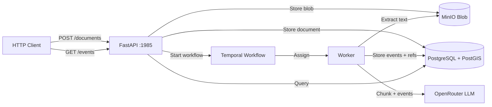

# Espacio Tiempo Humanos

A document ingestion and event extraction pipeline for Spanish-language legal/court documents. You submit text or PDFs, an LLM extracts structured events (where, when, who, what), and the result is fully traceable back to the original source.

Built 100% by Deepseek v4 Flash via opencode + opengsd.

## Quickstart

```bash
cp .env.example .env        # set OPENROUTER_API_KEY
docker compose up -d        # starts all services
http :1985/health            # {"status": "ok"}
```

That's it. Submit a document, and the pipeline runs automatically.

### Services (all in one `docker compose up`)

| Service | Purpose | Port |
|---------|---------|------|
| **PostgreSQL** (+PostGIS) | Event storage, geospatial queries | 5432 |
| **MinIO** | PDF blob storage | 9000 |
| **Temporal** | Durable workflow engine | 7233 |
| **Temporal UI** | Workflow dashboard | 8080 |
| **API** | FastAPI — document ingestion + queries | 1985 |
| **Worker** | Temporal worker — runs extraction activities | — |

## How It Works

The pipeline is a single Temporal workflow (`DocumentProcessingV7Workflow`) that runs per document:

```
Submit → status=pending
  ↓
Extract text (PDF → pypdfium2, or use submitted text)
  ↓
Chunk (sentence-aware, ~512KB targets, part-provenance tracking)
  ↓ [for each chunk]
LLM extracts structured events (OpenRouter, JSON Schema output)
  ↓
Store events in PostgreSQL (event_v2, event_location, event_participant_v2, event_ref)
  ↓
Resolve references (compute character + page offsets for provenance)
  ↓
status=processed → ready to query
```

Each activity is retried (max 3 attempts, exponential backoff). If the worker crashes, Temporal resumes from the last completed step — no data loss, no duplicates.

### What Gets Extracted

For each document chunk, the LLM returns structured events with verbatim references:

```
Event: "Juan Pérez compareció ante el tribunal en Madrid"
  ├─ Location: Madrid
  ├─ Time: 15 de marzo de 2023
  ├─ Participants: Juan Pérez, María García
  └─ What happened: compareció ante el tribunal
```

Every verbatim mention (person name, place, date) is stored as a reference with exact character offsets — you can click a person in the UI and see the exact sentence they appear in.

### Querying Results

```bash
# List events (paginated, filterable by document)
http GET :1985/events

# Event detail with locations, participants, and references
http GET :1985/events/{id}

# Get processing logs for a document
http GET :1985/documents/{id}/logs

# Submit a plain-text document
http POST :1985/documents text="El día 15 de marzo..." filename="decl.txt"

# Upload a PDF
http POST :1985/documents/upload @file.pdf
```

There's also a web UI at `/ui` — no build step, vanilla HTML/CSS/JS served by FastAPI.

## Architecture



### Key Patterns

- **Durable execution** — Temporal survives crashes. Replay is safe (nullify-then-recreate pattern prevents duplicates).
- **Search-first resolution** — Entity resolution checks existing canonical entities before calling the LLM. Exact matches skip the LLM entirely (20-50% savings).
- **Deterministic offsets** — Page numbers and character offsets are computed from chunk metadata, never hallucinated by the LLM.
- **Provider-agnostic LLM** — Protocol-based abstraction (`LLMProvider`). OpenRouter is first; swap without changing extraction logic.
- **Full audit trail** — blob → text → chunks → events → references → canonical entities. Every step timestamped, every value traceable.

## Status

Active milestone: **v7.0 Event-Centric Rewrite** — new PostgreSQL schema with unified event model, smart chunking (512KB sentence-aware), part-by-part LLM extraction, event list/detail UI with clickable references.

Prior milestones shipped:
- v6.1 — LLM call logging & viewer
- v6.0 — Event-centric data quality & UI
- v5.x — Entity resolution, cost tracking, prompt fixes
- v4.0 — Pipeline quality, reference offsets, search-first resolution
- v3.0 — Web UI
- v2.0 — Blob & chunk pipeline
- M001/M002 — Core pipeline + entity resolution

## Configuration

Copy `.env.example` → `.env`. Key variables:

| Variable | Default | Description |
|----------|---------|-------------|
| `OPENROUTER_API_KEY` | — | API key for LLM access |
| `OPENROUTER_MODEL` | `openai/gpt-4o-mini` | LLM model for extraction |
| `CHUNK_SIZE_TARGET` | `524288` | Target chunk size in chars (512KB) |

## Tests

```bash
docker compose run --rm integration-tests   # TypeScript test suite
uv run pytest                                 # Python tests
```
